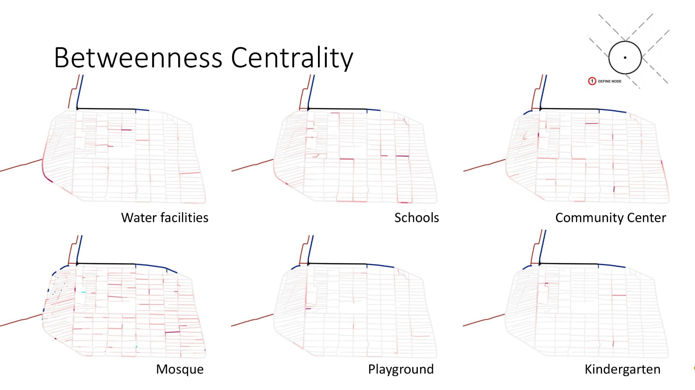
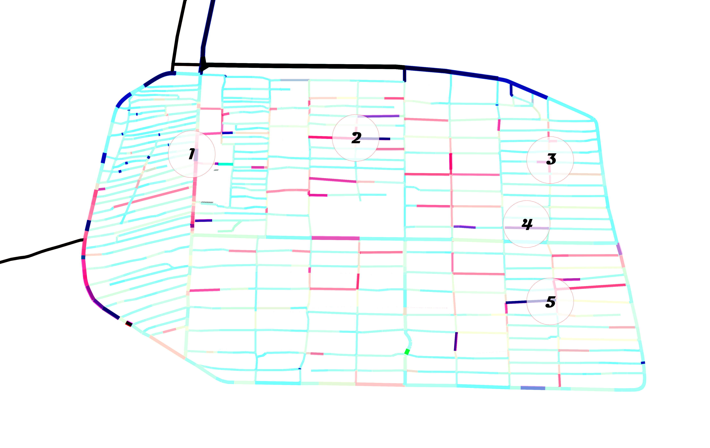

# Betweenness analysis

 
Rules:

* No cars aloud 
* Access to water
* Near to a Mosque
* Near a logistical point
* Input: the original map

 

* Location 1 is not applicable due to main car street, 
* Location 5 is not applicable due to big distance from logistical point. 

Conclusion:
Decided between 2-3-5 -->Choosen location: 2
-> Near highest density camp
 

