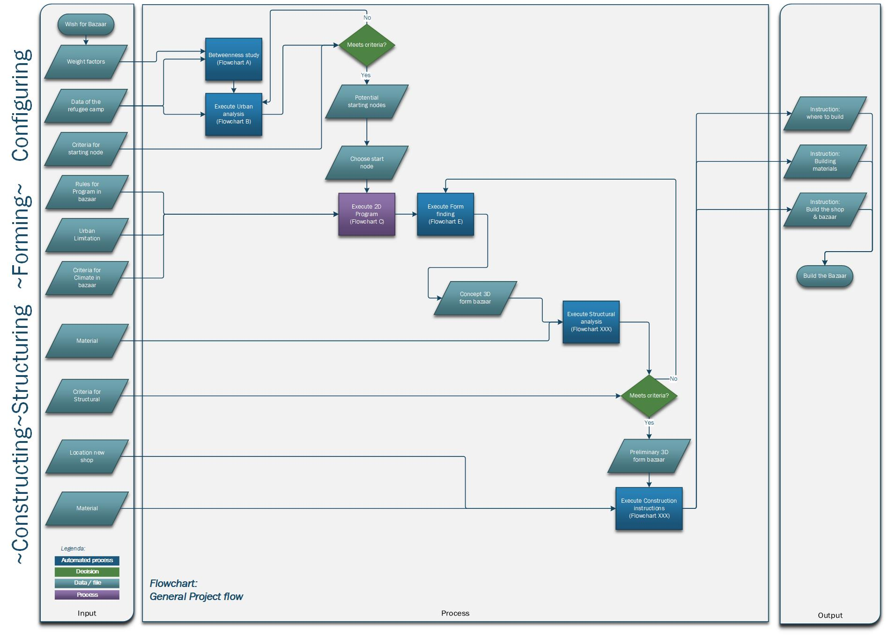
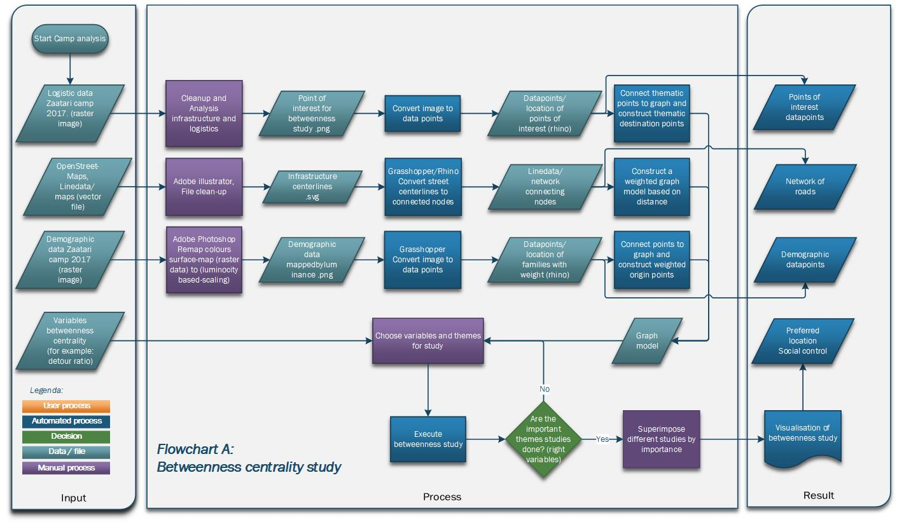
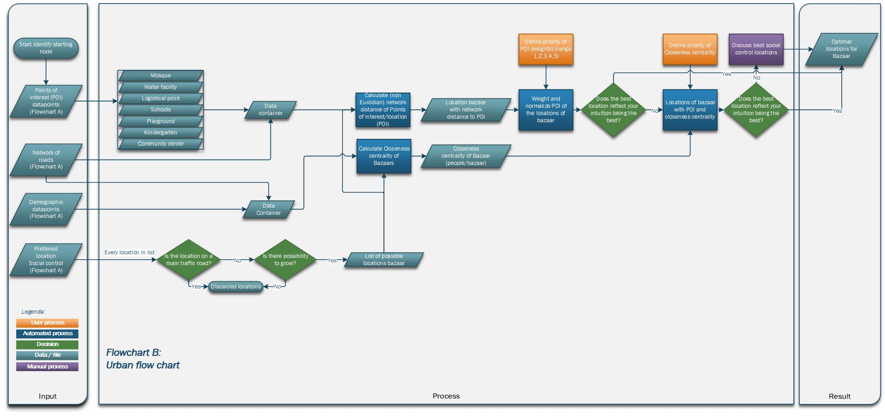

# General flowcart
Our overall workflow is structured by the course guidelines. The course guidelines consist of four steps describing the ‘Earthy’ design process. We tried to follow this structure as good as possible. But instead of creating a product we decided to create a method. As similar problems occur within other refugee camps, Our solution might also be applicable there. Looking at the design process this led to the following flowchart structured according to the four course points: Configuring, Forming, Structuring and Constructing.

### Zaatari camp
First, the focus is to find the starting point(s) of the bazaar by analysing the flows in the camp through use of the database available (e.g. the streets, houses, attractor points, demographic information). 
Once the starting point is decided through the output of the flow analysis and a group discussion, the team can move on by shaping the start of the bazaar.
 This is important because the initial start of the bazaar should be in line with the vision we have in mind for the bazaar and also it should be attractive for the zaatari refugees. After this, two processes should be going parallel. The first one is the process of structuring the bazaar by doing structural analysis. Meanwhile, the app/program as described in the “Design goals” section, should be developed within grasshopper and python.
More details of a process in the flowchart are referenced to another more detailed flowchart.
 After betweenness centrality study will result in a superimposed map, giving the best solutions (in reference to social control) for a given camp. In Zaatari this resulted in 5 possible locations. 

# Flowchart A: Betweenness study
Flowchart B describes the process of testing other variables that might influence the choice of the location of the Bazaar. Examples are the execution of a closeness centrality study of the bazaars and the population, and testing the created rules to the results of the betweenness centrality study. The resulting locations - in the case of zaatari, 3 - will be hand selected given on the scoring results of the betweenness centrality study, the closeness centrality study and the implicit values estimated by the available urban designers.
 

# Flowchart B: Urban flowchart
For finding a location we focussed on a methodological approach. If a bazaar showcases to be an effective measure against certain problems in Refugee camps it allows to apply the same method to other refugee camps. The data that we used to get to a location is satellite information, demographic information and logistical information map (often available of refugee camps to help aid). For the search of the optimal location the flowchart underneath was created.

