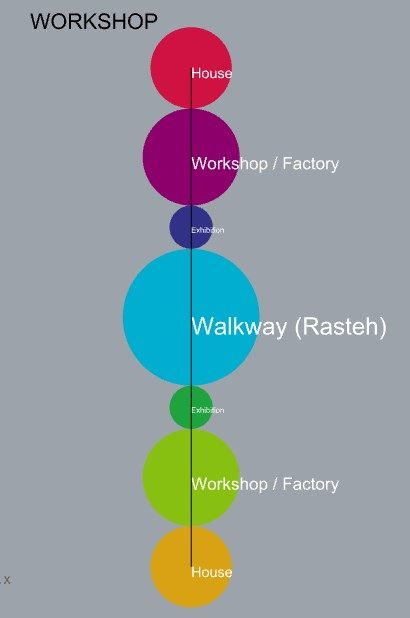
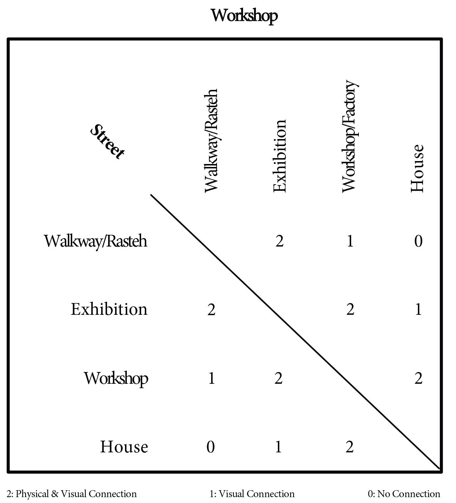
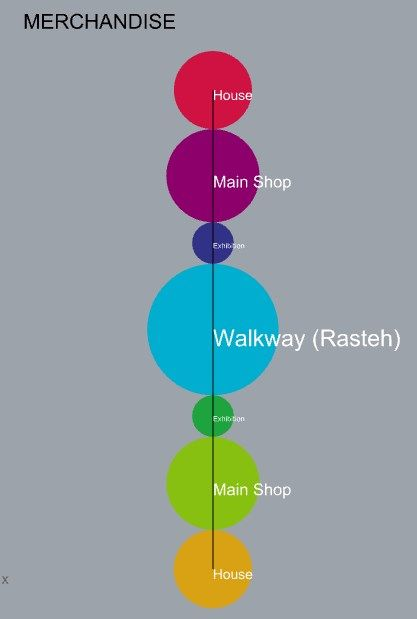
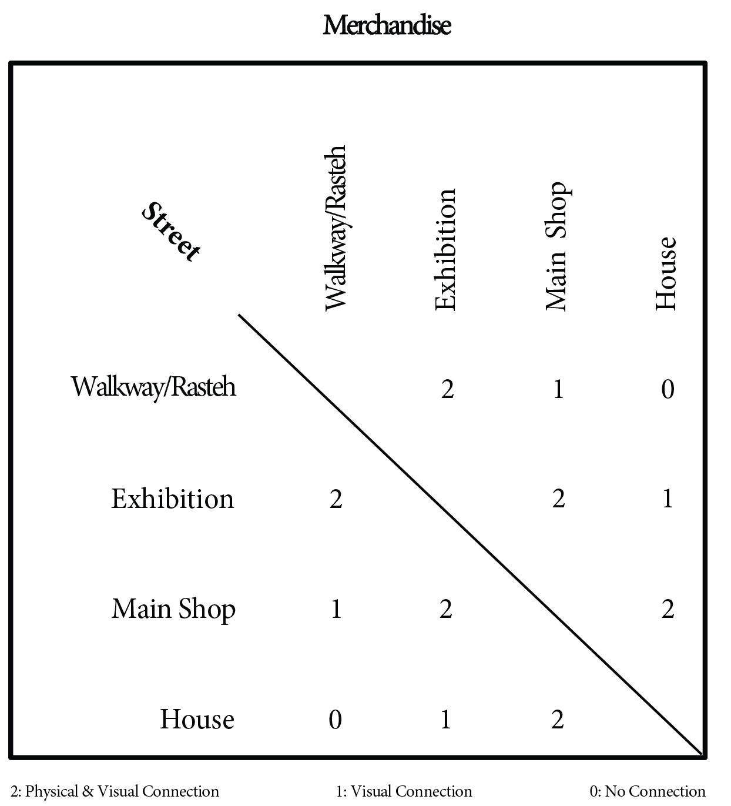
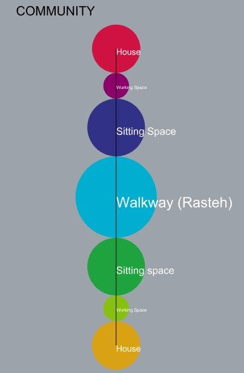
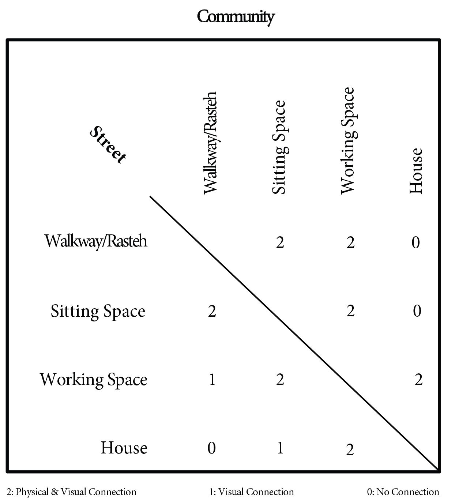

# Bubble Diagram & REL Program orientated

## Workshops
The workshops refers to the spaces inside the bazaar in which people from the refugee camp will produce different goods and offer services.
In this configuration the workshops consist of a working space (workshop / factory) and an exhibition space. The exhibition spaces will be open spaces arranged on the sides of the walkway followed by the workshops which will be enclosed spaces which could also provide storage space for the goods displayed on the exhibition spaces in the closing hours. The workshop space ranges between a minimum of 10 m2 up to above 20 m2.
House containers could be attached to the workshop spaces on the outer part of the bazaar, providing the possibility to the owners of the different workshops to be directly connected to their working space.
 

## Merchandise
This variant refers to a cluster of functions related to selling goods like pharmacies, general fabric stores, phone stores, etc.
In this configuration the shops consist of a main shop in which different goods will be sold and several services provided (like phone repairs or haircuts among other services), and exhibition spaces which will be extensions of the main shops, with direct connection to people coming from the walkway. In this case people have access to both the main shop and the exhibition area. The shops will have areas ranging from 10 m2 to 20m2. In this case, the houses could also be attached to the different shops from the outer part of the bazaar.
 

## Community
This variant refers to a cluster of functions related to meeting activities like restaurants, cafes, tea shops, etc.
In this configuration the exhibition spaces disappear to leave room for chairs and tables for people to meet and/or eat. The working spaces refer to the places in which the food is prepared and these spaces require small areas therefore they decrease in size giving away more room to the sitting space.
 

