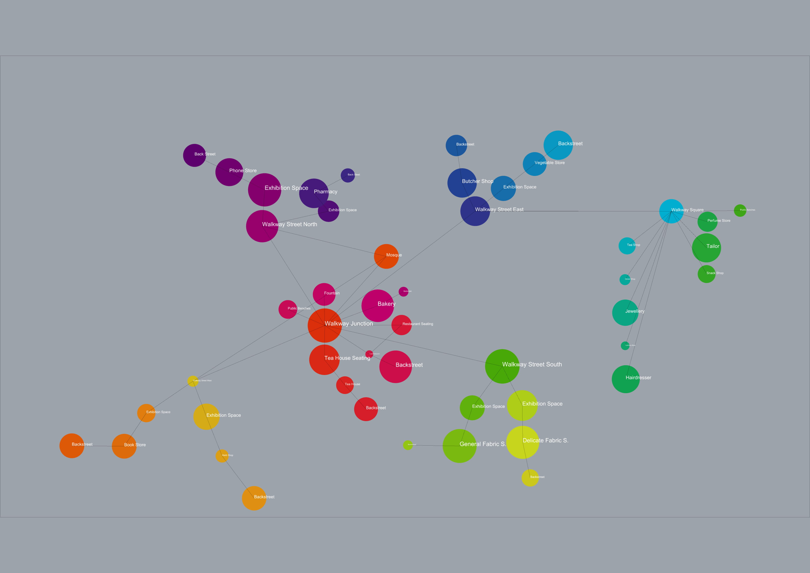
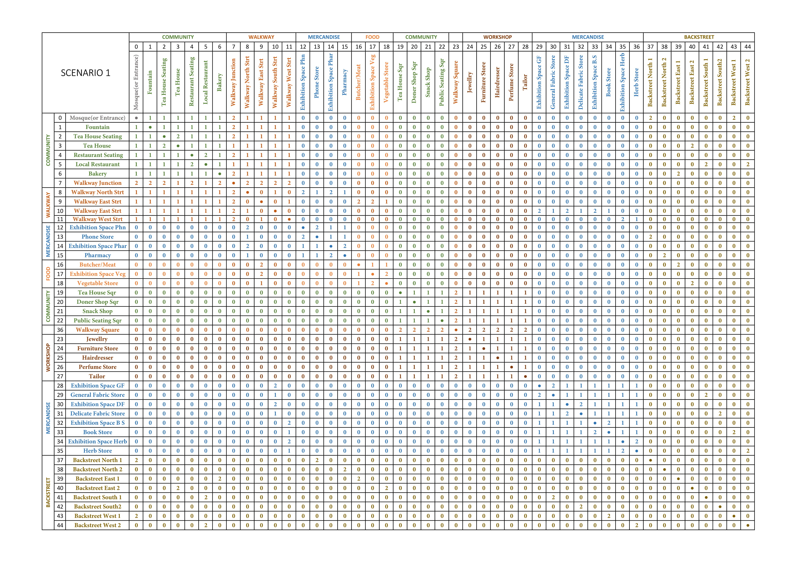

# Bubble Diagram & REL Chart: Scenario 1

In this scenario, the junction is a combined location for community and food stores. The walkways are clustered per sector. Also, a square is added for the workshop related activies due to the noise production. For walkway areas, houses can be added above the shops for the social security.

 

REL chart:
* 0 = No connection
* 1 = Visual connection
* 2 = Physical & visual connection