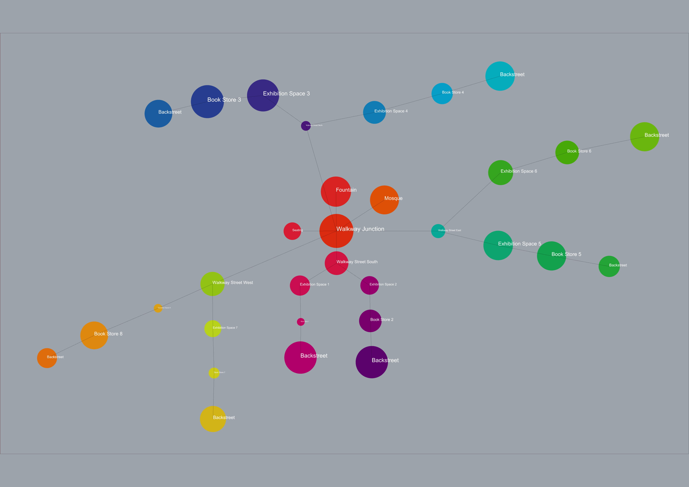

# Bubble Diagram: Scenario 2

In this scenario, the junction has no commercial purpose as there is no store located. It is only used for logistics in the bazaar and to the mosque. The walkways are clustered per sector. For walkway areas, houses can be added above the shops for the social security.
REL chart is excluded as it is time consuming for this scale and scenario 1 is choosen to develop further in this design.
 

 