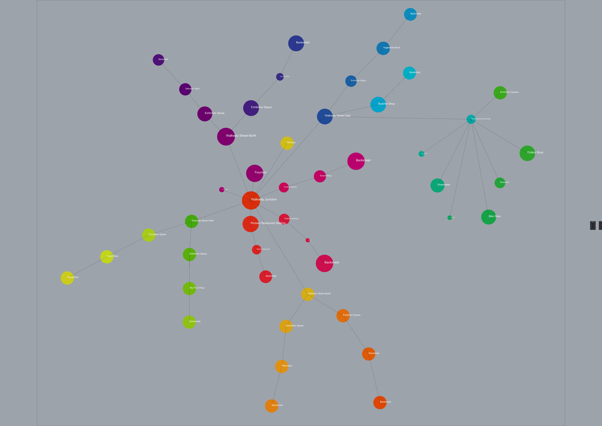

# Bubble Diagram: Scenario 3

In this scenario, the junction has only community stores as restaurants and teahouses. The walkways are clustered per sector. For walkway areas, houses can be added above the shops for the social security.
REL chart is excluded as it is time consuming for this scale and scenario 1 is choosen to develop further in this design.
 

 