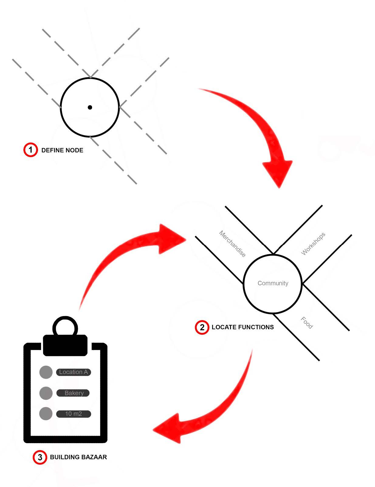
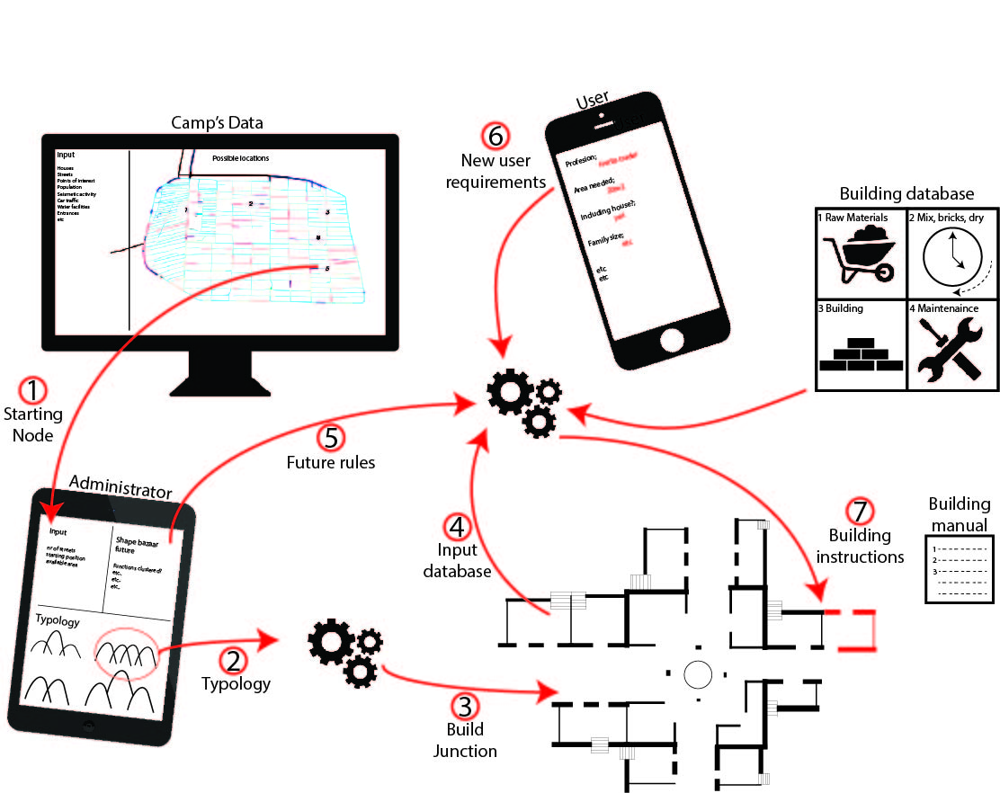

# Goal 
As a bazaar can be placed on different locations in the camp or in future camps, we
decided to develop a method. The method will be digital manual integrated in an app which
is divided into three sections (figure 1):

## General
1. Where to locate the bazaar (a node)?
The location of the bazaar will be a starting point as it can grow whenever the demand is there. Therefore, an urban map will show the nodes where the start of the bazaar can be built based on pedestrian flows and functions in the camp.
2. Where to place a certain function in the bazaar?
The type of bazaar is based on the street dimensions and functions in the bazaar. This is based on a drop down list in the app as the new entrepreneur can select his/her main function of the company and the needs in e.g. square meters, noise, water, needed supplies. From there, a location around or near the node will be chosen so guilds are not mixed.
3. How to build/ expend the bazaar (simple and understandable drawings)?
The building process is part 3 of the manual. Here, the results of the location is shared and how to build the part of the bazaar by using simple and understandable drawings. These will describe how to make the bricks and how to assemble it in the building. Therefore, we try to avoid language manuals as it should be accessible for all education levels. After the newly built part of the bazaar is added, the database in the app/program is updated and when a new customer wants to add a new shop, all previously added shops are taken into account.

## Scheme
1. Determine the starting node based on the data of the camp. The administrator will choose one node from the proposed nodes. 
2. For the junction, several options are shown to build it. 
3. The start of the junction is there.
4. The data of the junction (incl. functionality) is looped to the database.
5. Rules for future development and instructions of how the bazaar should be build as a modulair item are also included in the database. 
6. The future user can now use the application to select the wishes for a shop in a bazaar which is looped back to the database. 
7. When the user agrees with the location and other proposels, the user will also receive a building instruction how to build his part of the bazaar. 

