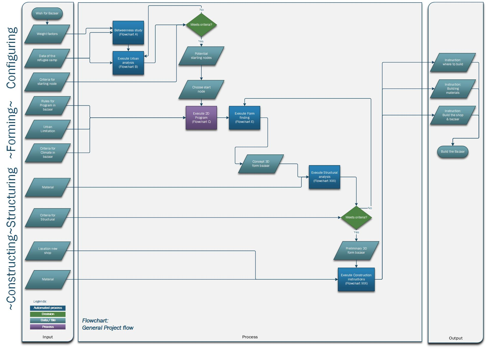
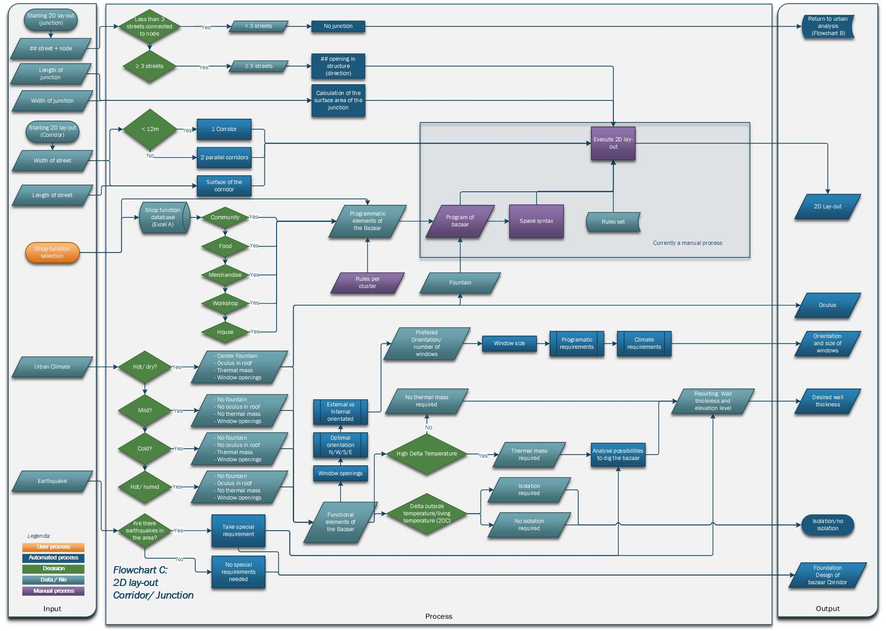
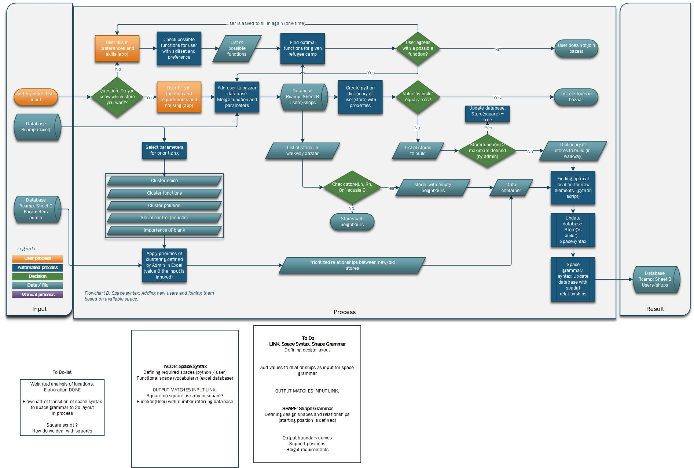
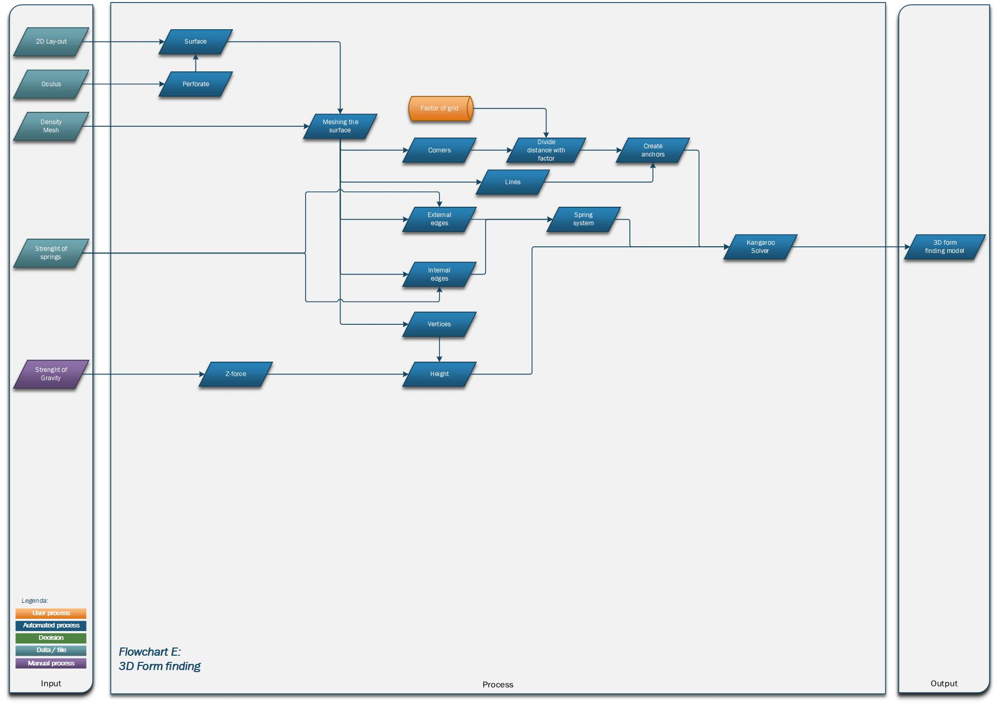

[Previous flowcharts description](https://gitlab.com/zaatari-bazaar/zaatari-bazaar/blob/master/A1%20Configuring/1_Flow%20charts/README.md)

# Flowchart C: 2D Lay-out flowchart
When the location - read as starting node - is found we need to better understand the local conditions and situation. Understanding the local urban fabric, Climatic conditions, road fabric. This resulted in 2 different aspects.
 
* Understanding the current situation, Urban climate, 2D layout Corridor and Junction
* Getting the available users within the refugee camp with their wishes. 

 
This resulted in 4 different processes:

* Defining the spaces - based on local user input - and requirements of spaces.
* Understanding the spatial relationship between spaces within a bazaar (functions) and creating a vocabulaire. (excel database of relations).
* Finding optimal locations for stores, based on user input, their vocabulaire and relationships with other stores. (space-syntax/space grammar).
* Translating locations towards an 2D-layout and input for form finding, based on the defined ‘space grammar’.

 
Showcases the steps taken to understand the local conditions, requirements of thermal mass, boundaries for the bazaar, This also still includes the current manual process of creating a 2D layout. Currently we are in the process to create a fitting space-grammar to translate the local conditions into a working floorplan, and input for our form-finding. This is harder than expected.

# Flowchart D: Space syntax flowchart
This flowchart shows the process of the user perspective. At which, he fills in his preferences and based on that gets added to the database of the bazaar. This is the first step of the automated ‘’space syntax, syntax/grammar, space grammar approach’’ process. This will later replace the manual process. The space grammar/syntax workflow is further described in chapter 3 Pseudocode. 

# Flowchart E: Form finding flowchart
In this flowchart, the process of using the Grasshopper plug-in "Kangaroo" is described. This flowchart is still in progress as we are still working on form finding the bazaar. 

