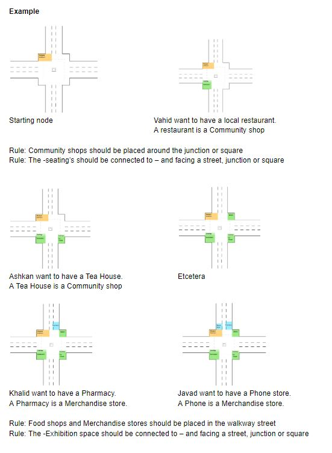
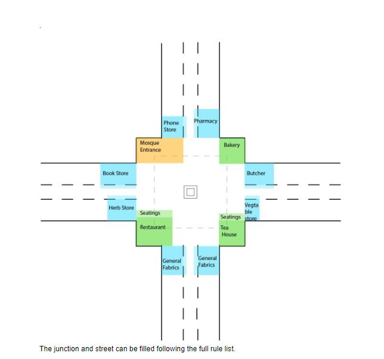

# Guidelines Bubble Diagram/ Plan:
A set of guidelines are created to give the administrators of the refugee camp a set of nudges in the right direction to from a bazaar that has a high qualitative value. These guidelines are by no means set in stone but when followed as much as possible, they are able to increase the quality of the bazaar.

* Food shops and Merchandise stores should preferably be placed in the walkway street
* Community shops should preferably be placed around the junction or square
* Workshops should be preferably placed into a square
* Shops which produce a lot of noise should preferably not be next to shops that don’t generate a lot of noise
* Shops which produce a lot of noise should preferably not be next to community shops
* Every spot in the bazaar should preferably be visible from a house (bazaar can stay open 24/7)
* If a new shop owner would like a house, there should be space for it
* When the streets have a minimum width of 24m a second street is created
* The -seating’s should be connected to – and facing a street, junction or square
* A community area should have public seating to rest and communicate
* Seatings should be designed for temporary seating (no sleeping place)
* A walkway street is at least 2.4m in width
* A walkway street is connected to the walkway junction and/or walkway square
* A shop owner should take care of the walkway in front of his street
* Similar functions should preferably be clustered together
* The -Exhibition space should be connected to – and facing a street, junction or square
* Every shop in the street should have a backstreet
* A backstreet should have a width of at least 1.2m
* The street (12m width) includes the walkway, exhibition spaces, shops and backstreets
* In the square are seating’s for community shops nearby, workshops and community stores don’t have their own seatings
* A square should not be in a main street.
* Functions that produce pollution (dust, air pollution) should preferably not be connected to consumables.
* The bazaar follows the existing fabric of the refugee camp: Streets grow where current streets are, junctions grow where streets cross. 
* Every 50m there is a possibility to exit the bazaar to the backstreets.
* People with shops in the square should take care of the central public square space
* The new construction should be build against the existing structure 
* If the store could be classified as a “pre-determined destination shop”, it should preferably not be placed in a high density route, to improve the density in other areas.
* High amount of “pre-determined destination shops”,could create a square, which could be placed connected to a low density street, to improve the density.

Note: 
* It is unrealistic to think that the bazaar will grow until proportions we don't want it to grow within the life span of a refugee camp.

# Example

### Result
