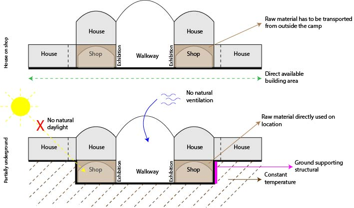
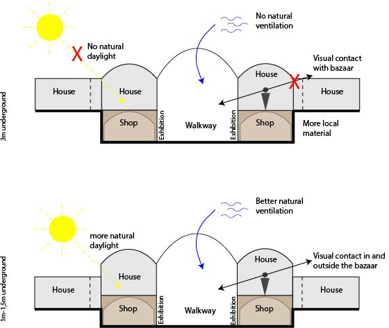
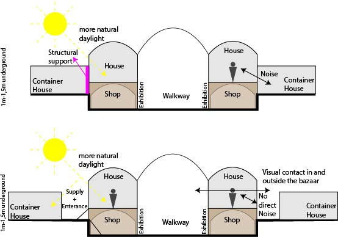

# Decision 1: Digging in VS not digging in 

* Not digging: Building area directly available
* Digging: Using material immediately
* Digging: Using the digged space immediately 
* Digging: Helps for constant climate conditions
* Digging: Helps for supporting the earth structure
* Not Digging: Transporting earth material costs time
* Digging: Leak of natural light
* Digging: Negative impact the airflow

### Conclusion: Digging in

# Decision 2: Digging in 3m VS Digging in 1-1.5m

* Digging in 3m: Better for the climate
* Digging in 3m: More material available
* Digging in 1-1,5m: Natural light
* Digging in 1-1,5m: Natural ventilation possible
* Digging in 1-1,5m: Visual connection with in and outside the bazaar

## Conclusion: 1,5m digging in

# Decision 3: Housing connected vs Housing not connected

* Housing connected: Structural
* Housing not connected: Natural lighting
* Housing not connected: Natural ventilation
* Housing not connected: visual connection in and outside the bazaar
* Housing not connected: Supplied via the back + enterance house 
* Housing not connected: Extra emergency exit
* Housing not connected: Less noise from neigbors

and
* Housing from earth: Original architecture
* Housing from earth: Everybody can build their own shop/house (no original house required)
* Re-use caravan: Lighter than earth material
* Re-use caravan: The object cannot be towed in place (manpower and knowledge)

and
* House located on top: social security in the bazaar
* House located on top: shop owner can live near his shop

# Decision 4: Round Junction vs Square Junction
* Square junction: More efficient due to space usage 
* Square junction: Suits in current urban lay-out
* Round Junction: Reflects the function of coming together

## Conclusion: Houses will be made from earth and bazaar will not be connected with current located houses. 

 
 

# Clustering shops

## Pro clustering
* Lower costs thanks to shorter distances to transport goods
* They can share information, skills and ideas. Called 'knowledge spillover'.
* Customers know where to go in the bazaar for certain products.
* Production of noise is equal for nearby shops
* Make use of your neighbors’ customers.
* Similar modules
* Good/service/Waste management

## Cons clustering
* More diversity in shops per m2 – Longer distance
* Competition