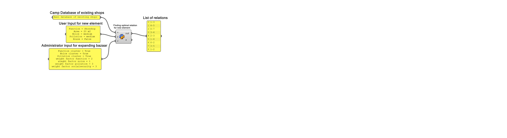
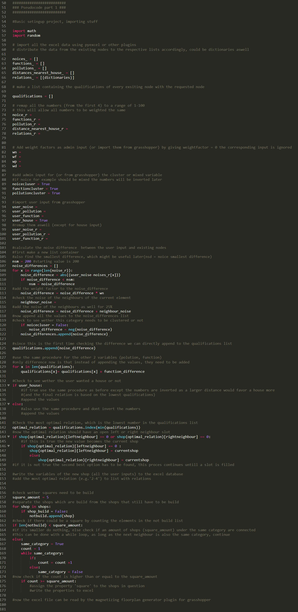
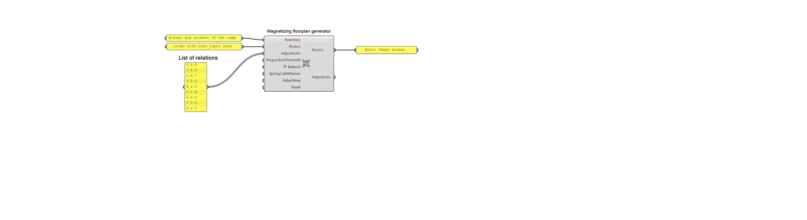
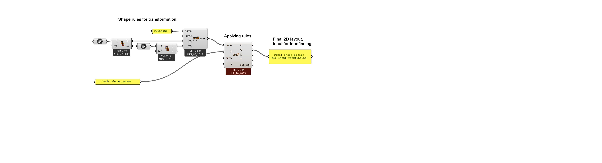
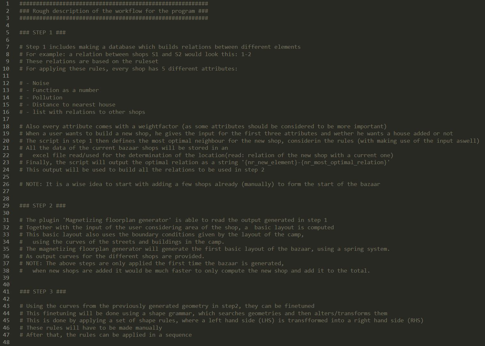

#########################
### Pseudocode part 1 ###
#########################

This pseudocode describes the process of defining the best relation for a new shop compared to the existing shops. The code takes the database of the existing bazaar as input, as well as the requirements the user gives for his new shop. Also, admin input will help set the priorities of how the bazaar should be formed straight.

#########################
### Pseudocode part 2 ###
#########################

This part of the pseudocode is about generating the basic shape of the bazaar, from the output generated in step 2 (list of relations between elements). This is done using a magnetizing plugin, which allows for the input of relations and room areas to generate different iterations of how the bazaars shape could be formed. This step is still a work in progress and might, in the end, require a lot of manual work.

#########################
### Pseudocode part 3 ###
#########################

This part of the pseudocode is about transforming the basic geometry into a more refined geometry which could be used for the form finding. This transformation is done using shape grammar. Shape grammar is a method which is able to define certain geometry (left hand shape) and transform this geometry using rules into a transformed geometry (right hand shape).

