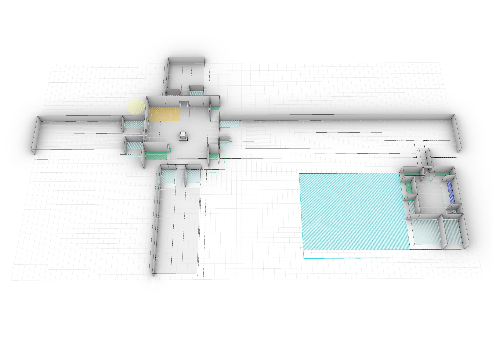
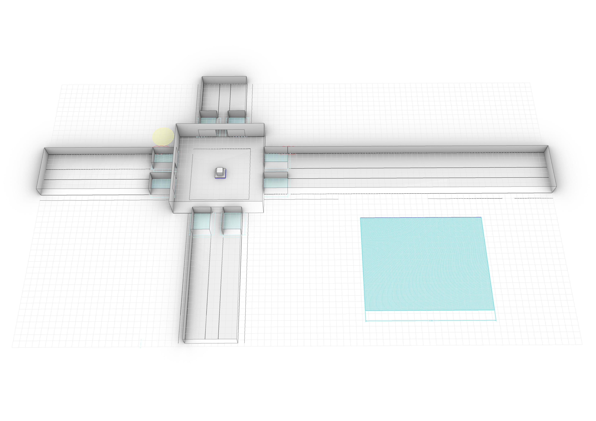
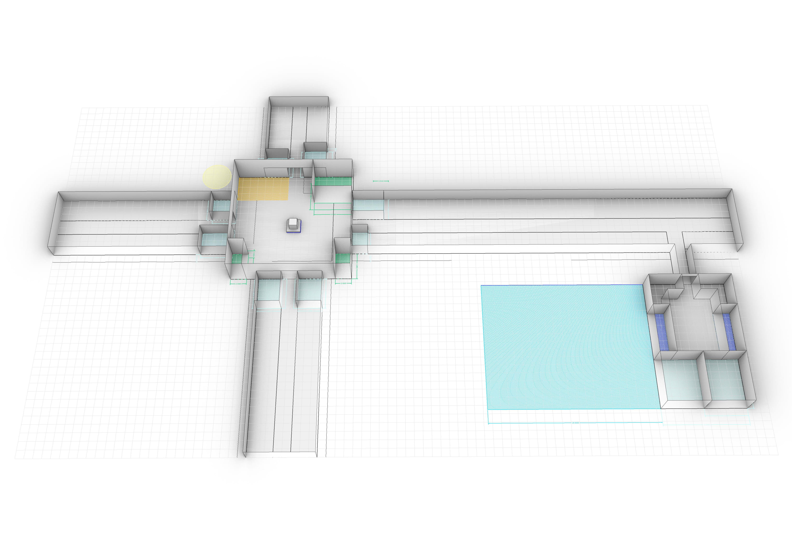

# 2D Lay-out

## Scenario 1
In this scenario, the junction is a combined location for community stores. The walkways are clustered per sector. Also, a square is added for workshops and community, which produce low noise. Walkway areas, houses can be added above the shops for the social security.
 

## Scenario 2
In this scenario the guidelines are tested; what will happen if there are only merchandise stores and they follow the guidelines? The junction will remain empty and the merchandise stores will come in the street. This can be seen in the picture below. For walkway areas, houses can be added above the shops for the social security.
 

## Scenario 3
In this scenario, the junction has only community stores as restaurants and teahouses. The walkways are clustered per sector. For walkway areas, houses can be added above the shops for the social security. Also, a square is added for workshops only, this is done for clustering noise.
 
