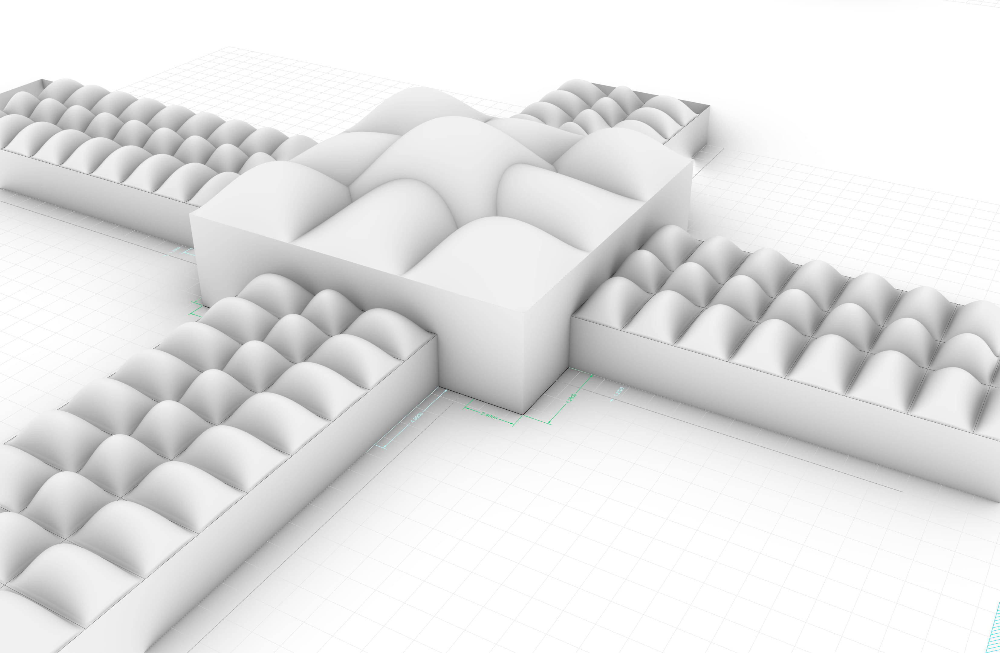
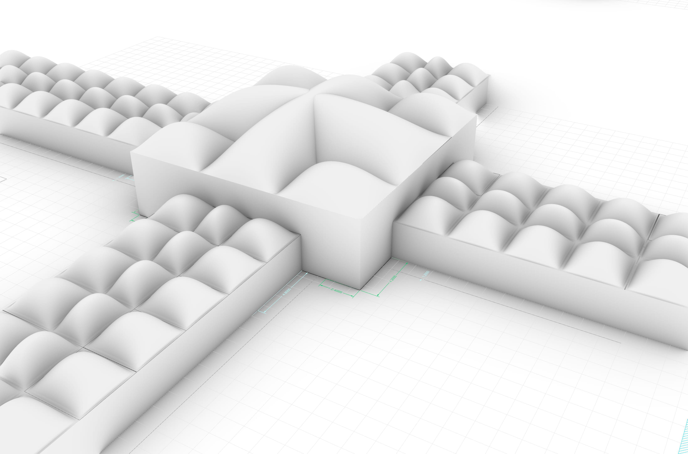
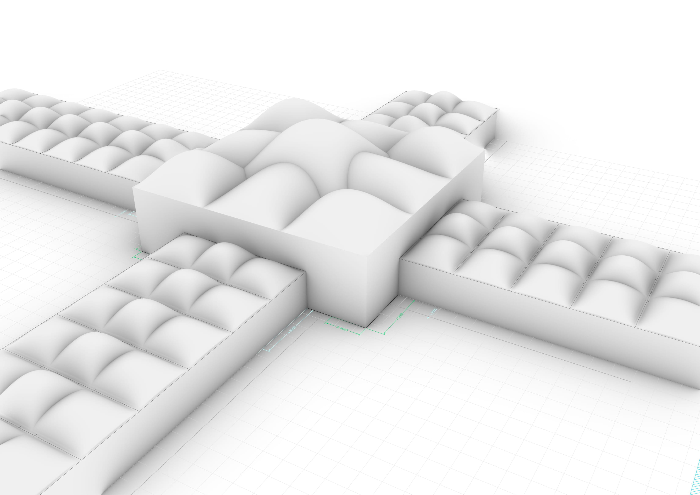
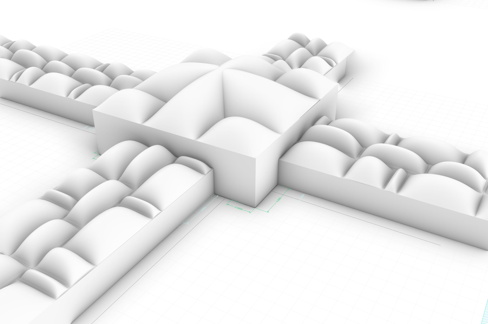
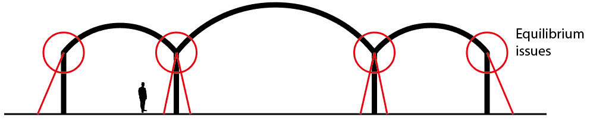
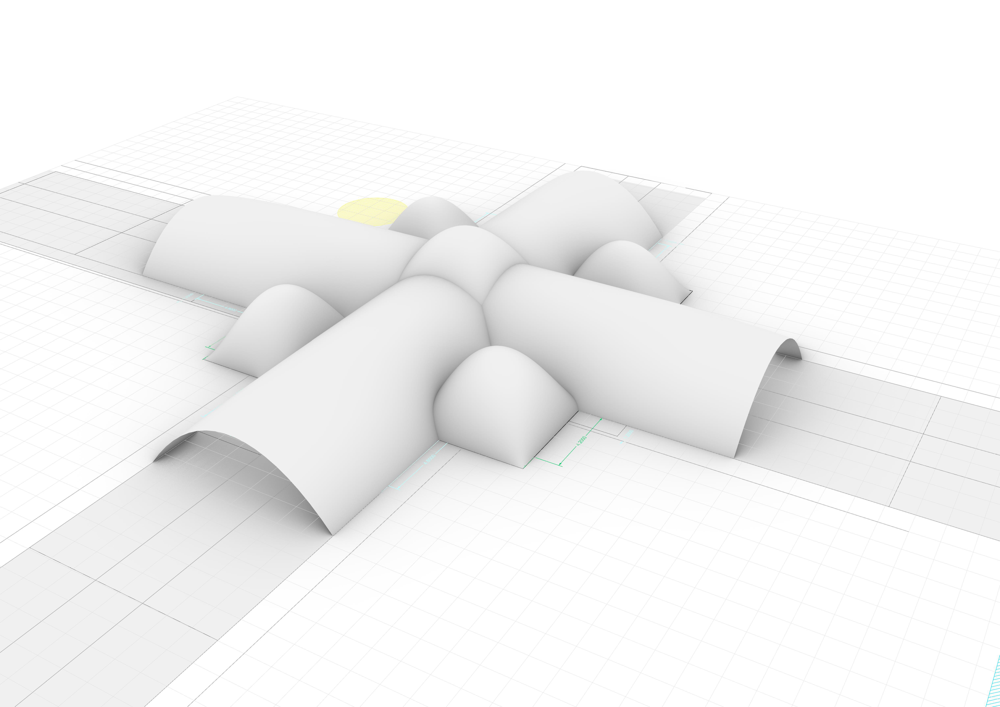
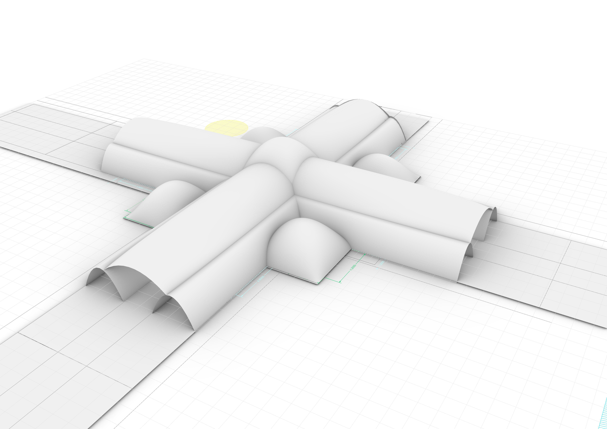
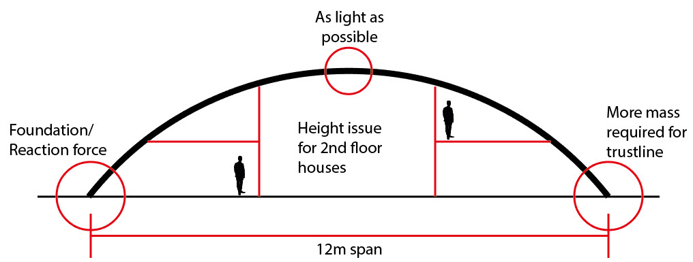
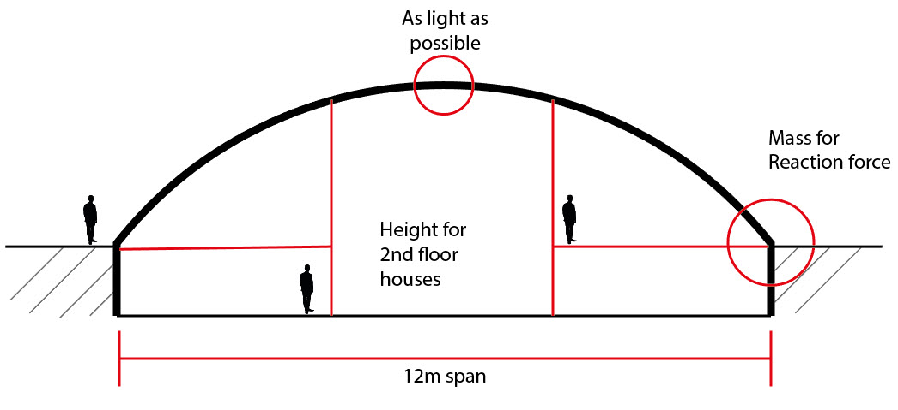

# Forming variants
Different scenarios responding to the internal configuration of the bazaar are proposed in order to start giving a specific shape to the building.
This first approach can be later optimized in order to have a more relaxed shape of the building which is also more structurally efficient.

## Variant 1: Equal distribution roof grid
In this variant, the anchors of the form finding are based on a 2,4 by 2,4 grid as the factor is 1,2m. This shows all shop spaces are equal and have no diversity in program. 
 

## Variant 2: Equal Distribution Roof Larg grid
In this variant, the anchors of the form finding are based on a 3,6 by 3,6 grid as the factor is 1,2m. This shows all shop spaces are equal and have no diversity in program. 
 

## Variant 3: Shop corridor Equal
In this variant, the anchors of the form finding are based on a 1,2 by 3,6 grid for the shops and 2,4 by 3,6 grid in the corridors as the factor is 1,2m. This shows different sizes of shops, but also shows issues in building it modulair as the forces are not in equilibrium. 
 

## Variant 4: Growth difference sizes
In this variant, the anchors of the form finding are based on a 1,2 by 3,6 grid for the shops and 2,4 by 3,6 grid in the corridors as the factor is 1,2m. This shows different sizes of shops, but also shows issues in building it modulair as the forces are not in equilibrium.
 

## Challanges variant 1-4
The different arches shows an challange in making sure there is a equilibrium as the column is not following the trustline. 
 

## Variant 5: Vaults
Single: In this variant, the shops and corridor are under a single vault roof, which can be built in a modular way. One main advantage of this variant is that it gives uniformity to the walkways of the bazaar and makes the construction easier and faster.
 
Triple: In this variant the shops are under a smaller and different vault roof than the corridors. There is a structural advantage on this variant, and it is that the vaults have shorter spans than the previous variant. making them more stable.

 

## Challanges variant 5
The heighest part of the dome should be as light as possible due to the dead weight forces to the foundation. Also, when houses are added above the shops, the height should be considered as the space below the arch should be useful. Therefore, the option for digging the bazaar in is suggested. 
 

