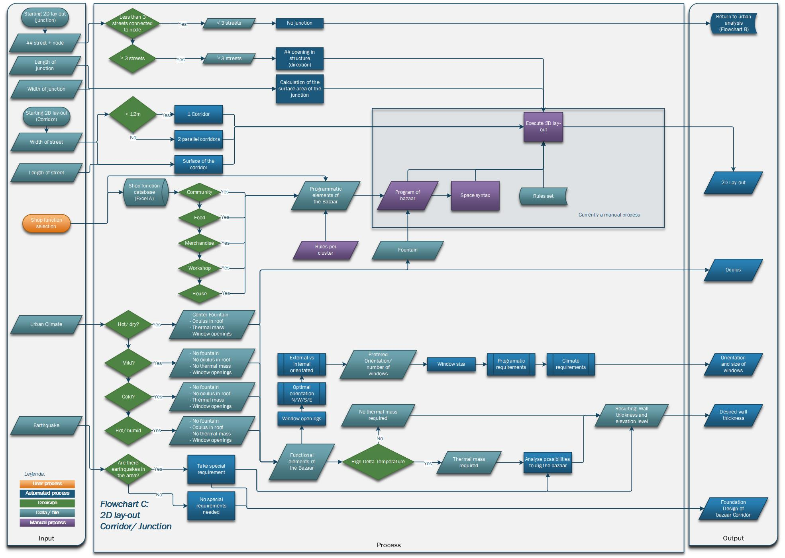
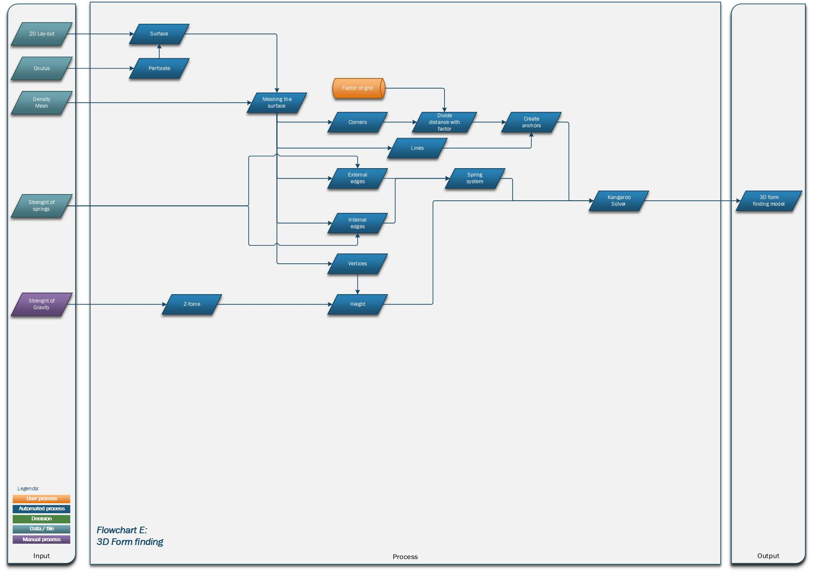
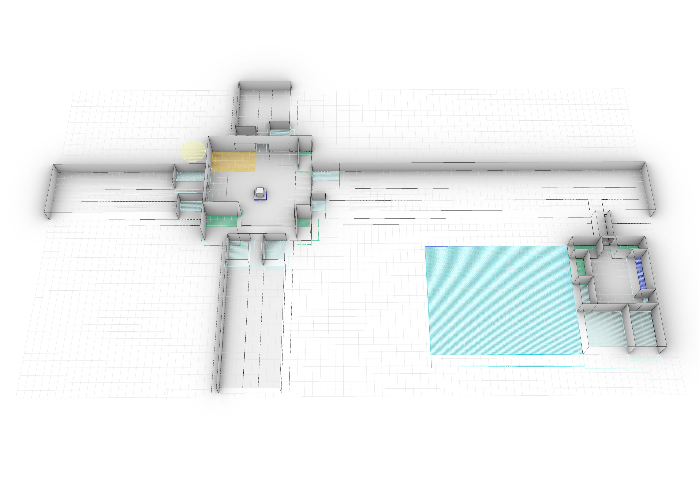
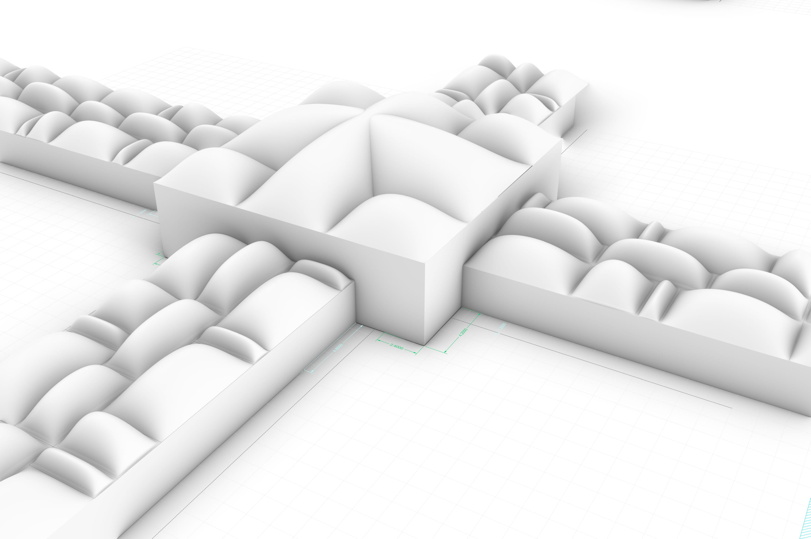
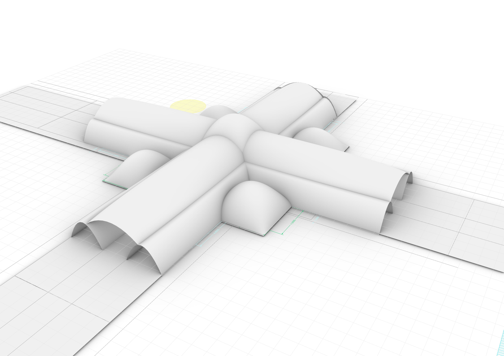

# Assignment | Form finding

All materials in the configuration phase are updated and used for the form finding phase, see below shortcuts to the documents:
* [Main folder](https://gitlab.com/zaatari-bazaar/zaatari-bazaar/tree/master/A1%20Configuring)
* [General & Urban flow charts](https://gitlab.com/zaatari-bazaar/zaatari-bazaar/blob/master/A1%20Configuring/1_Flow%20charts/README.md)
* [Bubble diagram & REL Chart](https://gitlab.com/zaatari-bazaar/zaatari-bazaar/blob/master/A1%20Configuring/2_Bubble%20Diagram&REL/README.md)
* [Program of requirements](https://gitlab.com/zaatari-bazaar/zaatari-bazaar/blob/master/A1%20Configuring/3_Program%20of%20Requirement/README.md)

For the form finding process, we first manually configured the bubble diagram to a floor plan. At the moment, we are working on making the manually part computitional as this is part of our goal to create a app for all regufee camps. 
 
 
 
The floorplan is based on a 1,2m grid and rules sets. 
 
 
 
When we completed the floor plan, we made five variants in form finding. First, the mesh was tessellated in squares. We researched the effect of having different tessellation shaps, but for a vault and simple dome, the final results was the same. 
  The form finding is based on a spring system. We gave different strengths to the internal curves and external curves as we wanted to understand what will happen.
 
 
 

More info:

* [Flowcharts](https://gitlab.com/zaatari-bazaar/zaatari-bazaar/blob/master/A2%20Forming/0_Flowcharts/README.md)
* [Rules set](https://gitlab.com/zaatari-bazaar/zaatari-bazaar/blob/master/A2%20Forming/1A_Rules%20and%20decisions/Scenario%20decision%20making/README.md)
* [Pseudocodes](https://gitlab.com/zaatari-bazaar/zaatari-bazaar/blob/master/A2%20Forming/1_Pseudocodes/README.md)
* [2D Lay-out](https://gitlab.com/zaatari-bazaar/zaatari-bazaar/blob/master/A2%20Forming/2_2D%20Lay-out/README.md)
* [Form finding](https://gitlab.com/zaatari-bazaar/zaatari-bazaar/blob/master/A2%20Forming/3_Form%20finding/README.md)

