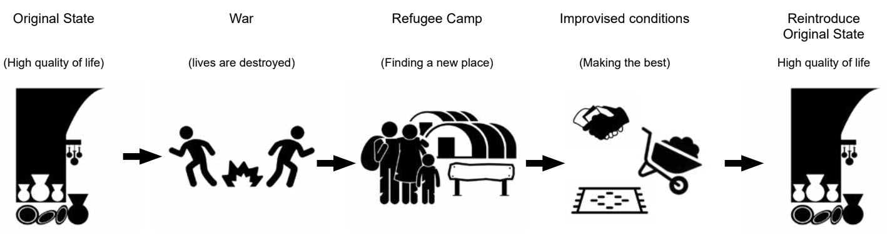
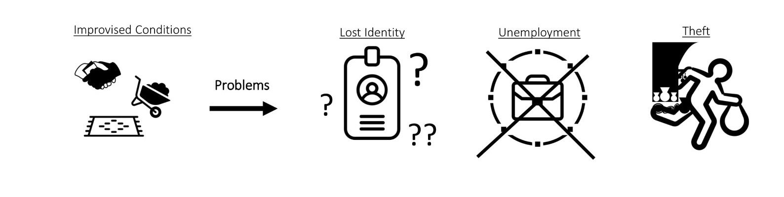

## Process

## Problem Statement
A steadily growing numbers of people are moving into refugee camps. At the moment, almost 80.000 Syrian refugees live in camp Zaatari. The emphasis of refugee camps is on establishing temporary solutions. In reality these camps exist for years and years. As it looks now, the people living in refugee camps will not move back soon. We would like to give these people an urban object which reinstate one of the values the refugees lost in their previous lives, in this case the bazaar. By doing this we want to create a safe and social environment where people can do their daily activities such as doing groceries, going to school, social interaction with other people, eat and traverse.

 

 

## Group 2 Members:

- Angela Smit 4463021
- Kees Leemeijer 4385896
- Deirdre van Gameren 4372867
- David den Ouden 4469712
- Reji Benoy 4800559
- Giancarlo Manzanares 4916352

## GITLAB layout and structure
The gitlab is structured by the 3 different section we will face within the earthy course. A markdown page shortly explains what was required within that period and how we tried to achieve it.
Each has his own folders where we will upload our work. 

## Main course sections
* [A1 Configuring](https://gitlab.com/zaatari-bazaar/zaatari-bazaar/tree/master/A1%20Configuring)
* [A2 Forming](https://gitlab.com/zaatari-bazaar/zaatari-bazaar/tree/master/A2%20Forming)
* [A3 Structuring](https://gitlab.com/zaatari-bazaar/zaatari-bazaar/tree/master/A3%20Structuring)
* [A4 Final](https://gitlab.com/zaatari-bazaar/zaatari-bazaar/tree/master/A4%20Final)
