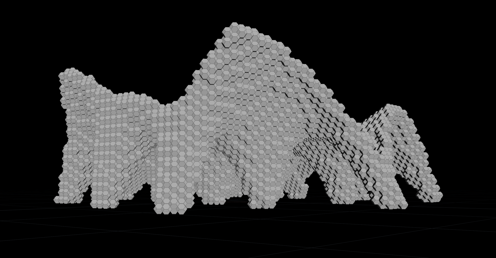

# [AR3B011](http://studiegids.tudelft.nl/a101_displayCourse.do?course_id=48158&_NotifyTextSearch_): Earthy: MSc3 Design Studio 2019-20

## Introduction

EARTHY is a master’s level design studio with the aim of designing and
engineering earthy buildings, in particular adobe buildings, intended
for mid-term accommodation of displaced communities. Our goal is to
design buildings that can be ideally built by their prospective
inhabitants. Earthy buildings are virtually 100% recyclable and,
compared to tents, they offer much more comfort. The use of earthen
materials necessitates the knowledge of complex geometry e.g. in
designing and technical drawing of vaults, domes and arches in optimal
shapes. The focus of the course is on the relations of materials, forms,
and structures, explored computationally. Automated construction design
and generation of assembly instructions are extra challenges to be
tackled via computation.

## People
<table width=100%>
    <thead >
        <tr class="header">
            <th colspan="2">Instruction Team</th>
        </tr>
    </thead>
    <tbody>
        <tr>
            <td>Course Coordinator</td>
            <td><a href="mailto:p.nourian@tudelft.nl">Dr. Ir. P. Nourian</a></td>
        </tr>
        <tr>
            <td>Instructors</td>
            <td>
                <a href="mailto:p.nourian@tudelft.nl">Dr. Ir. Pirouz Nourian</a> (TU Delft, Design Informatics, PZN) 
                <a href="mailto:S.Azadi-1@tudelft.nl">Ir. Shervin Azadi</a> (TU Delft, Design Informatics, SAZ) 
                <a href="mailto:J.J.J.G.Hoogenboom@tudelft.nl">Ir. Hans Hoogenboom</a> (TU Delft, Design Informatics-HHG) 
                <a href="mailto:F.R.Schnater@tudelft.nl">Ir. Frank Schnater</a> (TU Delft, Design of Construction, FSN) 
                <a href="mailto:Dirk%20Visser%20-%20BK">Ir. Dirk Rinze Visser</a> (Buro Happold &amp; TU Delft, Structural Design &amp; Mechanics -DRZ) 
                <a href="mailto:FAVeer@tudelft.nl">Dr. Ir. Fred Veer</a> (TU Delft, Structural Design &amp; Mechanics-FVR) 
            </td>
        </tr>
        <tr>
            <td>Responsible</td>
            <td><a href="mailto:i.s.sariyildiz@tudelft.nl">Prof. Dr. Ir. Sevil Sariyildiz</a> (TU Delft, Design Informatics, SSZ)</td>
        </tr>
    </tbody>
    <thead>
        <tr class="header">
            <th colspan="2">Students</th>
        </tr>
    </thead>
    <tbody>
    <thead>
        <tr class="header">
            <th colspan="2">Students</th>
        </tr>
    </thead>
    <tbody>
        <tr>
            <td>
                <a href="https://github.com/shervinazadi/earthy_19/tree/master/Adobe_CC">Adobe CC</a>
            </td>
            <td>
                Aditya Parulekar 
                Andrea Fumagalli 
                Divyae Mittal 
                Filip Zielinski 
                Prateek Wahi 
                Tarang Gupta
            </td>
        </tr>
        <tr>
            <td>
                <a href="https://github.com/shervinazadi/earthy_19/tree/master/Bazaar">Bazaar</a>
            </td>
            <td>
                Angela Smit  
                Kees Leemeijer  
                Deirdre van Gameren  
                David den Ouden  
                Reji Benoy  
                Giancarlo Manzanares  
            </td>
        </tr>
        <tr>
            <td>
                <a href="https://github.com/shervinazadi/earthy_19/tree/master/Bustan">Bustan</a>
            </td>
            <td>
                Yarai Zenteno  
                Kazi Fahriba Mustafa  
                Patrattakorn Wannasawang  
                Akash Changlani  
                Elisa Vintimilla  
                Shasan Choksi  
            </td>
        </tr>
        <tr>
            <td>
                <a href="https://github.com/shervinazadi/earthy_19/tree/master/Jannat_Al_Tohr">Jannat Al-Tohr</a>
            </td>
            <td>
                Nikoleta Sidiropoulou  
                Hans Gamerschlag  
                Noah van den Berg  
                Maximilian Mandat  
                Rick van Dijk  
                Hamidreza Shahriari
            </td>
        </tr>
        <tr>
            <td>
                <a href="https://github.com/shervinazadi/earthy_19/tree/master/Modulabity">Modulabity</a>
            </td>
            <td>
                Alessandro Passoni 
                Alessio Vigorito 
                Fredy Fortich 
                Kiana Mousavi 
                Stephanie Moumdjian 
            </td>
        </tr>
        <tr>
            <td>
                <a href="https://github.com/shervinazadi/earthy_19/tree/master/Sand_Castle">Sand Castle</a>
            </td>
            <td>
                Konstantina Chouliara  
                Maria Dimas  
                Daniella Naous  
                Bart van Nimwegen  
                Ronald Rijsterborgh  
                Steven Engels  
            </td>
        </tr>
        <tr>
            <td>
                <a href="https://github.com/shervinazadi/earthy_19/tree/master/Women_for_Women">Women for Women</a>
            </td>
            <td>
                Amelia Tapia  
                Iro Stefanaki  
                Grammatiki Dasopoulou  
                Nayanthara Herath  
                Ioannis Tsionis
            </td>
        </tr>
    </tbody>
</table>

## Learning goals

After finishing this course, the student is expected to be able:

- to analyse the urban context, social-spatial structure, and vernacular traditions and develop an idea and a concept for the design responding to the context.
- to computationally design, utilize algorithms and underpin the architectural configuration of a settlement suitable for mass-customization in a circular construction process with low-cost materials, local labour, and low-tech construction techniques.
- to optimize complex geometric forms for a desired structural performance, given a local material and functional requirements.

## Design Challenge

You are requested to design for betterment of a district of the [Al
Zaatari Refugee Camp in
Jordan](https://en.wikipedia.org/wiki/Zaatari_refugee_camp). The course
is prepared for 40 students working in six to eight groups of three to
five students. The whole class is supposed to propose one Master Plan
(Configuration) and a set of Urban Design Guidelines for a
displaced-community, plan, and design communal buildings (proposed by
groups) and dwellings. In short, there will be at least eight sorts of
buildings to be configured and designed, each of which is assigned to a
single group. The entire class is responsible for the configuration of
\[one district of\] the site.

## Activities and Deliverables

* **A1_Planning**: a master plan for the site is produced by the whole class by super imposing multiple spatial analyses and ideas for improvements;
* **A2_Configuring**: each group composes a programme of requirement consistent with the master plan and an idea for the building with societal added value; specifies the intended user experience of the building in terms of a graph (bubble-chart) articulating the connections between the ‘floor spaces’; and proposes a 3D layout based on this bubble chart.
* **A3_Shaping**: given the 3D configuration of floor spaces and their intended heights, the group is to propose a basic tessellation of the ‘ceiling spaces’ into a mesh, dynamically relax that mesh to get an idealised shell structure geometry, and propose a topological system of masonry ceiling structures to function as a spatial structure in accordance with the idealized structure.
* **A4_Structuring**: given the found form in the previous step and the proposed tessellation, the group is to validate the discrete spatial structure consisting of blocks to ensure that it is constructible, structurally sound in the sense of being a compression-only structure, and safe during and after construction.
* **Final**:
  - A repository of codes and models of the project
  - A report of the project
  - A presentation about your design process (an update on midterm presentation)
  - An animation of the \[interactive\] computational design process.
  - An A2 poster including) and the followings: {architectural diagrams (space planning \[network\], configuration \[circulation manifold\], massing \[voxel cloud\]), functional modules, and renderings}
  
## Syllabus

After completing this course, the student is supposed to have gained 1)
knowledge, 2) insight, and 3) skill on the use mathematical and
computational principles, facts, conventions, and methods/algorithms in
the context of designing an earthy settlement. By collaboratively
working with and utilizing 3D Procedural Modelling, Finite Element
Analyses, Simulations, the students will be able to configure, design,
and construct a settlement for displaced communities (e.g. refugees/
victims of natural disasters).

### Theory

The subjects taught in this course are:

- Linear Algebra, Calculus and Differential Geometry
- Geometry, Topology, and Graph Theory
- Computer Graphics (Boundary Representations and Raster Representations)
- Finite Element Analysis
- Programming in Python
- Material Science of Earth, Material Combinations
- Structural Design with Earth
- Earth Architecture & Architectural Configuration (a.k.a. space
    planning)

### Practice

The Earthy Studio is focused on devising computational methods,
techniques and tools for analysis, synthesis, form-generation, and
optimization in:

- Configuring: planning the arrangement of a settlement for a displaced community considering accessibility of amenities, and functional layout of communal/public buildings;
- Forming: devising the 3D shape of the buildings based on their functional configuration, climatic functionality, and structural performance;
- Structuring: designing the construction process of an earth building for a zero-waste circular construction process

### License

This work is dual-licensed under MIT and 4.0-CC-BY. The Software is licensed under MIT and all other contents are licensed under 4.0-CC-BY. Each student project has different authors, please refer to AUTHOR file for detailed list of authors per project.
